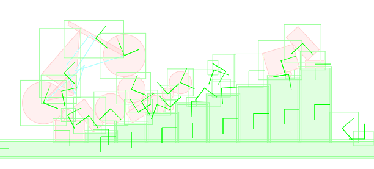

# Box2D full suspension mountain bike demo

## About
This is a simple example for creating a mountain bike with full suspension using Box2D.

It creates a mountain bike with a revolute joint for the back wheel damper and a prismatic joint for the front damper.

## Keys
- w : accelerate
- s : brake / move backwards
- a : Back brake
- d : Front brake
- p : Pause/Unpause physics
- o : Spawn some random dynamic objects
